<div align="center">

# 🔧 Ferretería — Sistema de Gestión Integral

**ERP ligero especializado en ferretería con panel administrativo, punto de venta y control total de inventario.**

[](https://nodejs.org/)
[](https://expressjs.com/)
[](https://react.dev/)
[](https://vitejs.dev/)
[](https://www.postgresql.org/)
[](https://tailwindcss.com/)
[](LICENSE)
[]()

[Descripción](#-descripción) · [Capturas](#-capturas-de-pantalla) · [Instalación](#-instalación) · [API](#-api-reference) · [Roadmap](#-roadmap)

</div>

---

## 📖 Tabla de contenidos

- [Descripción](#-descripción)
- [Capturas de pantalla](#-capturas-de-pantalla)
- [Características](#-características)
- [Stack tecnológico](#-stack-tecnológico)
- [Arquitectura](#-arquitectura)
- [Estructura del proyecto](#-estructura-del-proyecto)
- [Instalación](#-instalación)
- [Configuración](#-configuración)
- [Uso](#-uso)
- [API Reference](#-api-reference)
- [Modelo de datos](#-modelo-de-datos)
- [Roadmap](#-roadmap)
- [Contribución](#-contribución)
- [Licencia](#-licencia)
- [Autor](#-autor)

---

## 🎯 Descripción

**Ferretería** es un sistema de gestión completo diseñado específicamente para las necesidades de una ferretería moderna. Combina la potencia de un **ERP** con la simplicidad de un punto de venta tradicional.

### 💡 ¿Por qué este sistema?

La mayoría de los ERP comerciales son **caros, complejos y genéricos**. Este sistema fue diseñado desde cero pensando en las particularidades de una ferretería:

- ✅ **Venta fraccionada**: 2.5 metros de cable, 1.75 kg de clavos
- ✅ **Múltiples presentaciones**: pack x100, caja x50, unidad suelta
- ✅ **Actualización automática** de precios de compra
- ✅ **Kardex completo** para auditoría de movimientos
- ✅ **Cálculo de ganancia neta real** (ventas − CMV − gastos)
- ✅ **Alertas inteligentes**: stock bajo mínimo, productos estancados
- ✅ **CRM integrado** con segmentación automática de clientes

---

## 📸 Capturas de pantalla

### 🏠 Panel de Administración

Vista general del negocio con los KPIs más importantes: ventas del día, ventas del mes, ganancia neta, gastos, valor del inventario, alertas de stock bajo, productos estancados y ranking de productos más vendidos.

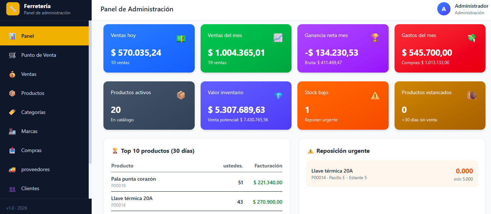

---

### 🛒 Punto de Venta (POS)

Interfaz optimizada para el mostrador con buscador instantáneo, lector de código de barras, grilla de productos con stock en tiempo real y carrito editable antes de cobrar.

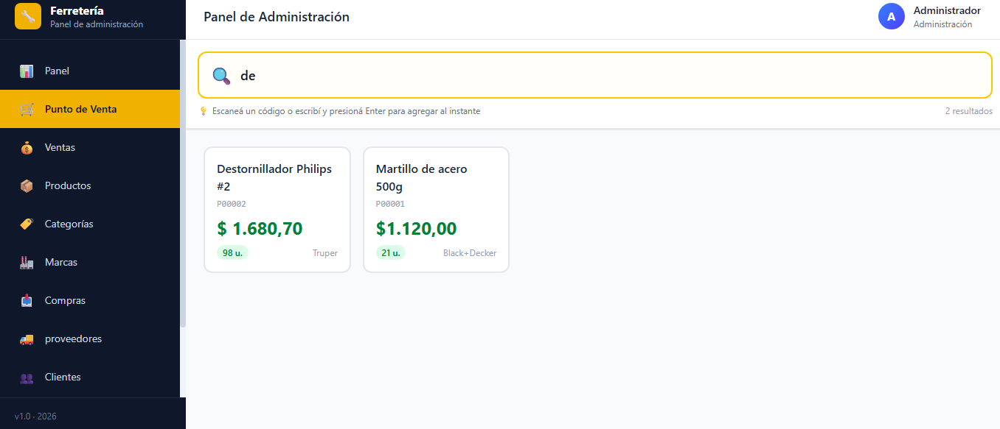

**Características destacadas:**
- 🔍 Búsqueda con debounce (250ms) por nombre, código o código de barras
- 📷 Lector de código de barras: escaneás y Enter agrega directo
- 📦 Soporte para unidades (`u.`, `m`, `kg`) y presentaciones (`pack x100`)
- ✏️ Carrito 100% editable: cantidades, precios, eliminación de items
- 💳 Múltiples formas de pago con íconos

---

### 💰 Gestión de Ventas

Historial completo de ventas con filtros por estado, búsqueda por cliente o vendedor, y cálculo automático de ganancia por venta.

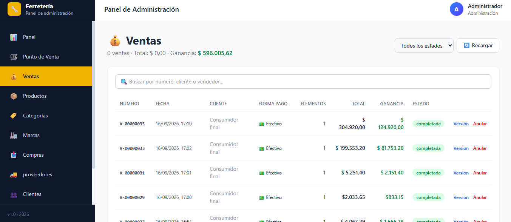

**Cada venta muestra:**
- Número único autocorrelativo (`V-00000035`)
- Fecha y hora
- Cliente (o "Consumidor final")
- Forma de pago con ícono
- Cantidad de items
- Total y ganancia calculada automáticamente
- Estado con badge de color
- Acciones: Ver detalle, Anular

---

### 📦 Catálogo de Productos

ABM completo con categoría, marca, presentación, precios de compra/venta, existencias, ubicación física y alertas de stock bajo.

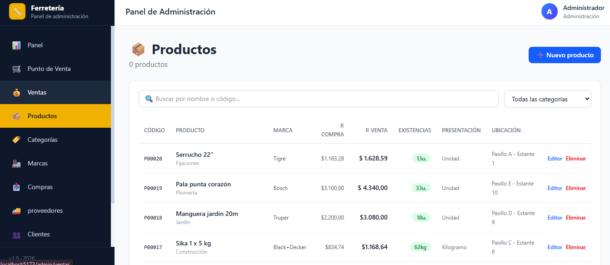

**Cada producto incluye:**
- Código interno (`P00020`) y código de barras
- Nombre y descripción
- Categoría y marca con relación
- Precio de compra y venta
- Existencias con badge coloreado (verde/rojo según stock mínimo)
- Presentación (`Unidad`, `Pack x100`, `Kilogramo`, etc.)
- Ubicación física (`Pasillo E - Estante 10`)

---

### 🏷️ Categorías

Organización del catálogo por categorías con contador de productos activos en cada una.

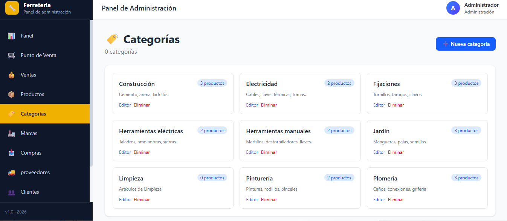

**Categorías incluidas:**
- Construcción → Cemento, arena, ladrillos
- Electricidad → Cables, llaves térmicas, tomas
- Fijaciones → Tornillos, tarugos, clavos
- Herramientas eléctricas → Taladros, amoladoras, sierras
- Herramientas manuales → Martillos, destornilladores, llaves
- Jardín → Mangueras, palas, semillas
- Limpieza → Artículos de limpieza
- Pinturería → Pinturas, rodillos, pinceles
- Plomería → Caños, conexiones, grifería

---

### 🏭 Marcas

Gestión de marcas con visualización del catálogo por fabricante.

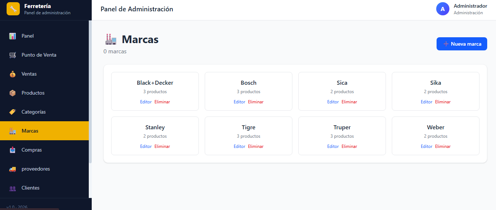

**Marcas incluidas:** Black+Decker, Bosch, Sica, Sika, Stanley, Tigre, Truper, Weber.

---

### 📥 Gestión de Compras

Registro de compras a proveedores con actualización automática de stock y precios de compra vía triggers de base de datos.

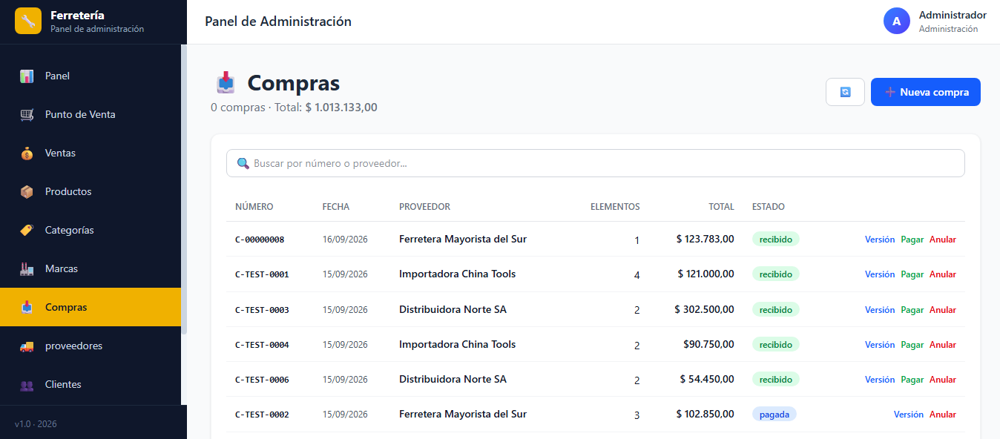

**Estados soportados:**
- 🟢 `recibida` → Stock sumado automáticamente
- 🔵 `pagada` → Pago confirmado
- 🟡 `pendiente` → En tránsito
- 🔴 `anulada` → Stock revertido

**Acciones:** Ver detalle, Pagar, Anular

---

### 🚚 Proveedores

Directorio de proveedores con CUIT, contacto, historial de compras y monto total comprado.

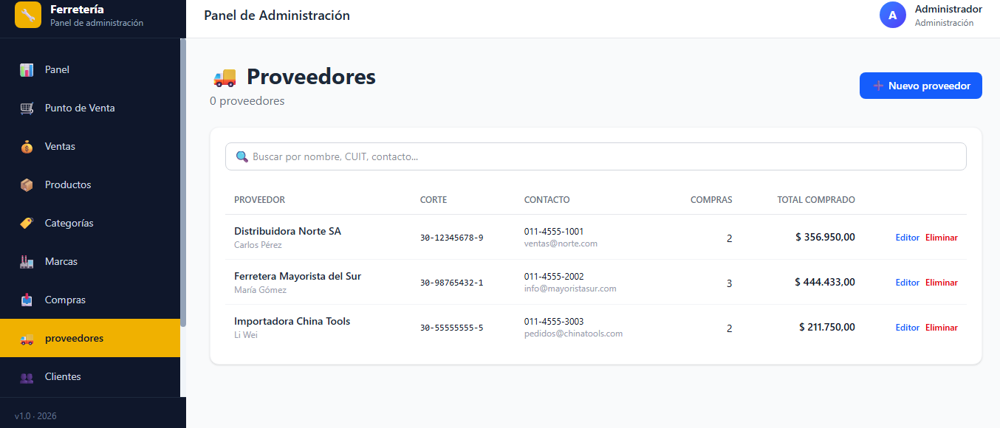

**Cada proveedor muestra:**
- Nombre y contacto
- CUIT
- Teléfono y email
- Cantidad de compras realizadas
- Monto total comprado

---

### 👥 Clientes

Base de clientes con CUIT/DNI, contacto, historial de compras, total comprado y saldo de cuenta corriente.

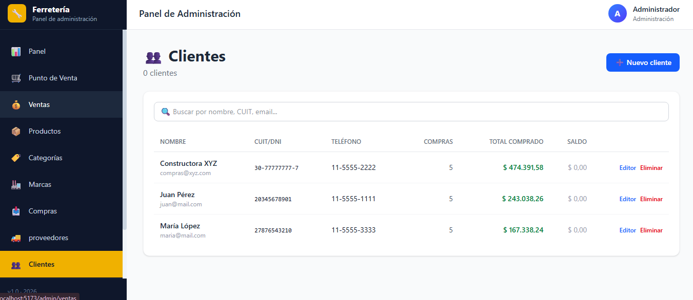

**Cada cliente muestra:**
- Nombre y email
- CUIT/DNI
- Teléfono
- Cantidad de compras
- Total comprado (en verde)
- Saldo (en rojo si debe)

---

### 🎯 CRM — Gestión de Clientes

Sistema completo de gestión de relaciones con clientes (CRM) con **segmentación automática** por actividad y valor.

#### Dashboard del CRM

Vista general con KPIs de segmentación: clientes nuevos, activos, tibios, fríos e inactivos. Clasificación por valor (VIP, frecuentes, ocasionales, esporádicos) y resumen de tareas y comunicaciones.

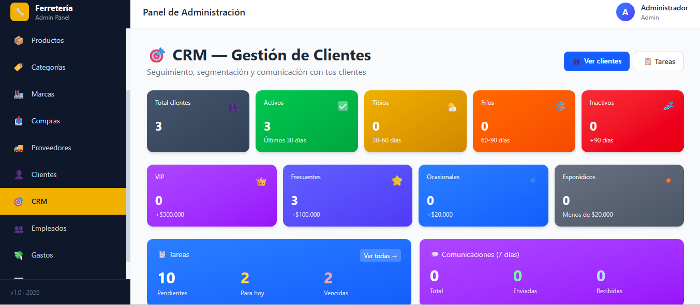

**Características destacadas:**
- 📊 Segmentación automática por **actividad** (última compra)
- 💎 Segmentación automática por **valor** (total comprado)
- 📋 Contador de tareas pendientes, vencidas y para hoy
- 💬 Resumen de comunicaciones (últimos 7 días)
- 🏆 Top 10 clientes por facturación
- ⚠️ Detección de clientes a contactar (+60 días sin comprar)

---

#### Lista de Clientes con Segmentación

Filtros rápidos por segmento, búsqueda por nombre/email/teléfono/CUIT, y vista de métricas por cliente.

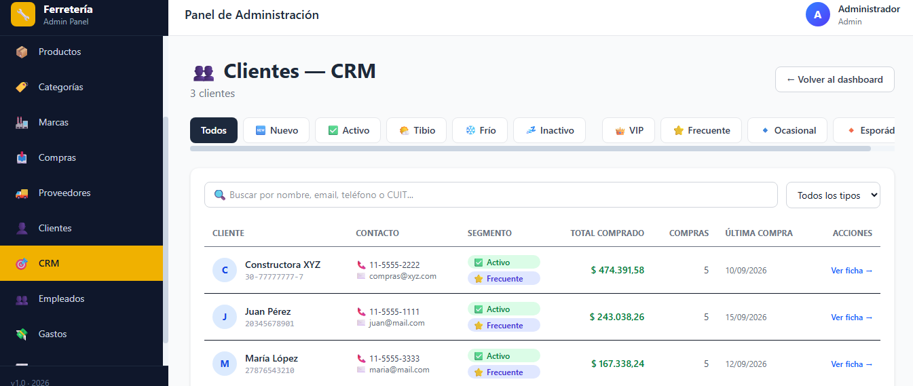

**Cada cliente muestra:**
- Badge de **actividad**: `🆕 Nuevo`, `✅ Activo`, `🌤️ Tibio`, `❄️ Frío`, `💤 Inactivo`
- Badge de **valor**: `👑 VIP`, `⭐ Frecuente`, `🔹 Ocasional`, `🔸 Esporádico`
- Total comprado, cantidad de compras y última compra
- Acceso directo a la ficha completa con historial

**Filtros disponibles:**
- Por segmento de actividad
- Por segmento de valor
- Por tipo de cliente (minorista, mayorista, empresa, profesional)
- Búsqueda de texto libre

---

#### Tareas y Recordatorios

Gestión de tareas con prioridades, asignación de clientes y seguimiento.

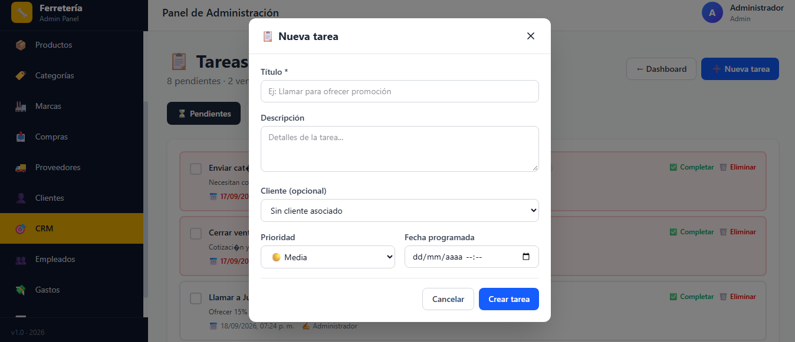

**Características:**
- ➕ Crear tareas con título, descripción, cliente y prioridad
- 🎯 Prioridades: 🚨 Urgente · 🔴 Alta · 🟡 Media · ⚪ Baja
- 📅 Fecha programada con alertas de vencimiento
- ✅ Marcar tareas como completadas
- 🔍 Filtros por estado y prioridad
- 👤 Asociación opcional a cliente

---

#### Ficha del Cliente

Ficha completa con toda la información del cliente:

- 📊 KPIs: total comprado, cantidad de compras, ticket promedio, última compra
- 📝 Datos completos (email, teléfono, CUIT/DNI, dirección, redes sociales)
- 🛒 Historial de compras completo
- 🏆 Productos más comprados
- 📋 Tareas asociadas
- 💬 Historial de comunicaciones
- 📝 Notas internas
- 📱 Botón directo de WhatsApp con mensaje pre-armado
- ✉️ Botón directo de Email

---

## ✨ Características

### 🛒 Punto de Venta (POS)
- Búsqueda instantánea por nombre, código o código de barras
- Lectura de código de barras con Enter directo
- Carrito editable: modificar cantidades, precios, eliminar items
- Soporte para cantidades decimales (2.5 m, 1.75 kg)
- Múltiples formas de pago (efectivo, débito, crédito, transferencia, cuenta corriente)
- Tickets numerados automáticamente (`V-00000001`)
- Cálculo automático de ganancia por venta

### 📦 Gestión de Inventario
- CRUD completo de productos con categorías, marcas y unidades
- Soporte para presentaciones (pack x100, caja x50, unidad)
- Alertas automáticas de stock bajo mínimo
- Detección de productos estancados (+30 días sin movimiento)
- Kardex completo con auditoría de todos los movimientos
- Ajustes manuales de stock con motivo

### 📥 Compras
- Registro de compras con proveedor, forma de pago y observaciones
- Actualización automática de stock vía triggers
- Actualización automática del precio de compra
- Anulación con reversión de stock
- Estados: pendiente, recibida, pagada, anulada

### 💰 Ventas
- Registro con cálculo desde BD (nunca confía en el front)
- Verificación de stock en tiempo real
- Múltiples formas de pago
- Anulación con devolución de stock
- 5 reportes estadísticos: resumen, por forma de pago, por vendedor, top productos, por día

### 💸 Gastos
- Tipos de gasto configurables (fijos, variables, impuestos)
- Gastos recurrentes con período
- Estadísticas por tipo y por mes
- Comparativa mensual con variación porcentual

### 📊 Reportes y KPIs
- **Dashboard** con 8 KPIs principales
- **Rentabilidad**: ingresos, CMV, ganancia bruta/neta, márgenes
- **Utilidad por producto** con ranking
- **Flujo de caja** de 12 meses
- **Top productos** más vendidos
- **Productos estancados** con capital inmovilizado
- **Distribución** por forma de pago
- **Ranking de vendedores**
- Exportación a CSV

### 🎯 CRM — Gestión de Clientes
- Segmentación automática por **actividad** (nuevo, activo, tibio, frío, inactivo)
- Segmentación automática por **valor** (VIP, frecuente, ocasional, esporádico)
- Ficha completa con historial, productos, tareas y comunicaciones
- Sistema de tareas con prioridades y recordatorios
- Notas internas por cliente
- Botón directo de WhatsApp y Email
- Dashboard con KPIs de segmentación

### 👥 Clientes y Proveedores
- CRUD completo con validación de duplicados
- Historial de compras/ventas por cliente/proveedor
- Cuenta corriente con saldo
- Límite de crédito

---

## 🛠️ Stack tecnológico

### Backend
| Tecnología | Versión | Uso |
|------------|---------|-----|
| **Node.js** | 20.x LTS | Runtime |
| **Express** | 4.x | Framework HTTP |
| **PostgreSQL** | 18.x | Base de datos |
| **pg** | 8.x | Cliente PostgreSQL |
| **JWT** | 9.x | Autenticación |
| **bcryptjs** | 2.x | Hash de contraseñas |
| **dotenv** | 16.x | Variables de entorno |
| **nodemon** | 3.x | Dev hot-reload |

### Frontend
| Tecnología | Versión | Uso |
|------------|---------|-----|
| **React** | 18.x | UI library |
| **Vite** | 5.x | Build tool |
| **TailwindCSS** | 4.x | Estilos |
| **React Router** | 6.x | Routing |
| **Axios** | 1.x | HTTP client |
| **Recharts** | 2.x | Gráficos |

### Base de datos
- **26 tablas** relacionales
- **4 vistas materializadas** para KPIs
- **5 triggers** automáticos (kardex, updated_at)
- **Índices GIN** para búsqueda full-text
- Soporte para cantidades decimales (`NUMERIC(12,3)`)

---

## 🏗️ Arquitectura

```
┌─────────────────────────────────────────────────────────────┐
│                    FRONTEND (React + Vite)                  │
│                                                             │
│  ┌──────────────┐  ┌──────────────┐  ┌──────────────┐     │
│  │   /admin     │  │    /pos      │  │    /shop     │     │
│  │  Dashboard   │  │  Punto de    │  │   Tienda     │     │
│  │  Productos   │  │    Venta     │  │   Pública    │     │
│  │  CRM         │  │              │  │              │     │
│  └──────────────┘  └──────────────┘  └──────────────┘     │
└─────────────────────────────────────────────────────────────┘
                            ↓ REST + JWT
┌─────────────────────────────────────────────────────────────┐
│                    BACKEND (Node + Express)                 │
│                                                             │
│  ┌────────────┐  ┌────────────┐  ┌────────────┐           │
│  │   Routes   │→ │Controllers │→ │  Services  │           │
│  └────────────┘  └────────────┘  └────────────┘           │
│                                        ↓                    │
│  ┌────────────┐  ┌────────────┐  ┌────────────┐           │
│  │  Models    │← │   Config   │← │ Middlewares│           │
│  └────────────┘  └────────────┘  └────────────┘           │
└─────────────────────────────────────────────────────────────┘
                            ↓ pg Pool
┌─────────────────────────────────────────────────────────────┐
│                     PostgreSQL 18                           │
│                                                             │
│  ┌──────────────┐  ┌──────────────┐  ┌──────────────┐     │
│  │   Tablas     │  │    Vistas    │  │   Triggers   │     │
│  │  (26 tablas) │  │ Materializadas│  │  (kardex)    │     │
│  └──────────────┘  └──────────────┘  └──────────────┘     │
└─────────────────────────────────────────────────────────────┘
```

---

## 📁 Estructura del proyecto

```
ferreteria/
│
├── docs/
│   └── screenshots/                  # Capturas de pantalla
│       ├── dashboard.png
│       ├── pos.png
│       ├── ventas.png
│       ├── productos.png
│       ├── categorias.png
│       ├── marcas.png
│       ├── compras.png
│       ├── proveedores.png
│       ├── clientes.png
│       ├── crm-dashboard.png
│       ├── crm-clientes.png
│       └── crm-tareas.png
│
├── backend/                          # API REST
│   ├── src/
│   │   ├── config/                   # Configuración (env, db)
│   │   ├── controllers/              # Manejo de req/res
│   │   ├── db/                       # Migraciones y seeders
│   │   ├── middlewares/              # Auth, errores
│   │   ├── models/                   # Capa de datos (CRUD)
│   │   ├── routes/                   # Endpoints
│   │   ├── services/                 # Lógica de negocio
│   │   │   └── marketing/            # Servicios del CRM
│   │   └── index.js                  # Entry point
│   ├── .env.example
│   └── package.json
│
├── frontend/                         # React + Vite
│   ├── src/
│   │   ├── components/               # UI reutilizable
│   │   ├── contexts/                 # Auth context
│   │   ├── pages/
│   │   │   ├── admin/                # Dashboard, POS, Productos...
│   │   │   ├── admin/crm/            # Dashboard, Clientes, Tareas
│   │   │   └── empleado/             # Panel de empleado
│   │   ├── services/                 # Axios API client
│   │   ├── utils/                    # Helpers
│   │   ├── App.jsx
│   │   └── main.jsx
│   ├── .env.example
│   └── package.json
│
├── .gitignore
├── README.md
└── LICENSE
```

---

## 🚀 Instalación

### Requisitos previos

- **Node.js** 20.x o superior → [Descargar](https://nodejs.org/)
- **PostgreSQL** 16.x o superior → [Descargar](https://www.postgresql.org/download/)
- **Git** → [Descargar](https://git-scm.com/)
- **VS Code** (recomendado) → [Descargar](https://code.visualstudio.com/)

### Clonar el repositorio

```bash
git clone https://github.com/mariomarquesto/ferretreria.git
cd ferretreria
```

### Backend

```bash
cd backend
npm install
```

### Frontend

```bash
cd ../frontend
npm install
```

---

## ⚙️ Configuración

### 1. Crear la base de datos

```sql
CREATE DATABASE ferreteria;
```

### 2. Configurar variables de entorno

Copiá `backend/.env.example` a `backend/.env`:

```bash
cp backend/.env.example backend/.env
```

Editá `backend/.env` con tus credenciales:

```env
# Servidor
PORT=4000
NODE_ENV=development

# Base de datos
DB_HOST=localhost
DB_PORT=5432
DB_USER=postgres
DB_PASSWORD=tu_password
DB_NAME=ferreteria

# JWT
JWT_SECRET=clave_secreta_larga_cambiar_en_produccion
JWT_EXPIRES=7d

# CORS
CORS_ORIGIN=http://localhost:5173
```

> ⚠️ **NUNCA subas el `.env` real a Git.** Está en `.gitignore`.

### 3. Ejecutar migraciones

```bash
cd backend
npm run migrate
```

### 4. Cargar datos de prueba

```bash
npm run seed
```

Esto crea:
- **1 usuario admin** (`admin@ferreteria.com` / `admin123`)
- **8 categorías** (Herramientas, Plomería, Electricidad, etc.)
- **8 marcas** (Truper, Bosch, Stanley, etc.)
- **20 productos** de ejemplo
- **3 proveedores** y **3 clientes**
- **5 plantillas de mensajes** para WhatsApp

---

## 🎮 Uso

### Levantar el backend

```bash
cd backend
npm run dev
```

Servidor en `http://localhost:4000`

### Levantar el frontend

En otra terminal:

```bash
cd frontend
npm run dev
```

Aplicación en `http://localhost:5173`

### Credenciales de prueba

```
Email:    admin@ferreteria.com
Password: admin123
```

### Scripts disponibles

**Backend:**

| Comando | Descripción |
|---------|-------------|
| `npm run dev` | Servidor con hot-reload |
| `npm start` | Servidor en producción |
| `npm run migrate` | Ejecutar migraciones pendientes |
| `npm run migrate:reset` | Borrar todo y re-migrar |
| `npm run seed` | Cargar datos de prueba |
| `npm run db:fresh` | Reset + seed |

**Frontend:**

| Comando | Descripción |
|---------|-------------|
| `npm run dev` | Vite dev server |
| `npm run build` | Build de producción |
| `npm run preview` | Preview del build |

---

## 📡 API Reference

### Autenticación

| Método | Endpoint | Descripción |
|--------|----------|-------------|
| `POST` | `/api/auth/login` | Iniciar sesión |
| `POST` | `/api/auth/register` | Registro de cliente |
| `GET` | `/api/auth/me` | Datos del usuario actual |
| `GET` | `/api/auth/empleados` | Listar empleados |
| `POST` | `/api/auth/empleados` | Crear empleado |

### Productos

| Método | Endpoint | Descripción |
|--------|----------|-------------|
| `GET` | `/api/productos` | Listar con filtros |
| `GET` | `/api/productos/:id` | Detalle |
| `POST` | `/api/productos` | Crear |
| `PUT` | `/api/productos/:id` | Actualizar |
| `DELETE` | `/api/productos/:id` | Eliminar (soft) |
| `GET` | `/api/productos/stock-bajo` | Alertas de stock |

### Ventas

| Método | Endpoint | Descripción |
|--------|----------|-------------|
| `GET` | `/api/ventas` | Listar con filtros |
| `POST` | `/api/ventas` | Registrar venta |
| `POST` | `/api/ventas/:id/anular` | Anular y devolver stock |

### Compras

| Método | Endpoint | Descripción |
|--------|----------|-------------|
| `GET` | `/api/compras` | Listar |
| `POST` | `/api/compras` | Registrar compra |
| `POST` | `/api/compras/:id/anular` | Anular y revertir stock |

### Reportes

| Método | Endpoint | Descripción |
|--------|----------|-------------|
| `GET` | `/api/reportes/dashboard` | KPIs principales |
| `GET` | `/api/reportes/rentabilidad` | Análisis de márgenes |
| `GET` | `/api/reportes/flujo-caja` | Últimos 12 meses |

### CRM

| Método | Endpoint | Descripción |
|--------|----------|-------------|
| `GET` | `/api/marketing/dashboard` | Dashboard del CRM |
| `GET` | `/api/marketing/clientes` | Lista con segmentación |
| `GET` | `/api/marketing/clientes/:id` | Ficha completa |
| `PUT` | `/api/marketing/clientes/:id` | Actualizar cliente |
| `POST` | `/api/marketing/clientes/:id/notas` | Agregar nota |
| `GET` | `/api/marketing/tareas` | Listar tareas |
| `POST` | `/api/marketing/tareas` | Crear tarea |
| `PUT` | `/api/marketing/tareas/:id/completar` | Completar tarea |
| `DELETE` | `/api/marketing/tareas/:id` | Eliminar tarea |
| `GET` | `/api/marketing/plantillas` | Plantillas de mensajes |

---

## 🗄️ Modelo de datos

### Entidades principales

```
usuarios ────┬── ventas ────┬── detalle_venta ────┐
             │              │                     │
             │              └── pagos_venta       │
             │                                    │
             └── cajas                              │
                                                    │
proveedores ── compras ──── detalle_compra         │
                    │                               │
                    └── (trigger suma stock)       │
                                                    ↓
categorias ──┐                                 productos
marcas ──────┼── productos ──┬── movimientos_stock ──┘
unidades ────┘                │
                              ├── alertas
                              │
clientes ────┬── ventas       │
             ├── cliente_comunicaciones
             ├── cliente_tareas
             └── cliente_pipeline
                              │
tipos_gasto ── gastos         │
campanas ───── campana_cliente│
publicaciones_redes ──────────┘
```

### Triggers automáticos

| Trigger | Tabla | Acción |
|---------|-------|--------|
| `trg_mov_stock_venta` | `detalle_venta` | Resta stock + kardex + alerta |
| `trg_mov_stock_compra` | `detalle_compra` | Suma stock + actualiza precio_compra + kardex |
| `trg_productos_updated` | `productos` | Actualiza `updated_at` |
| `trg_usuarios_updated` | `usuarios` | Actualiza `updated_at` |

### Vistas materializadas

- `mv_top_productos` → Top 10 productos vendidos (30 días)
- `mv_productos_estancados` → Productos sin movimiento (+30 días)
- `mv_resumen_diario` → Resumen de ventas/compras/gastos por día (365 días)
- `v_clientes_segmentados` → Clientes con segmentación automática

---

## 🗺️ Roadmap

### ✅ Completado
- [x] Estructura del proyecto
- [x] Base de datos con 26 tablas
- [x] Migraciones y seeders
- [x] Modelos con CRUD genérico
- [x] API REST de productos, categorías, marcas
- [x] API de clientes y proveedores
- [x] API de compras con trigger de stock
- [x] API de ventas con trigger de stock
- [x] API de gastos con estadísticas
- [x] Reportes y KPIs
- [x] Panel administrativo (React)
- [x] POS con buscador y carrito editable
- [x] Soporte de unidades (UN, MT, KG) y presentaciones (pack, caja)
- [x] Login con JWT
- [x] Dashboard con gráficos
- [x] Sistema multi-rol (admin + empleado)
- [x] Gestión de empleados
- [x] **CRM completo** con segmentación automática
- [x] **Sistema de tareas y recordatorios**
- [x] **Ficha del cliente con historial**
- [x] Screenshots del sistema

### ⏳ En progreso
- [ ] WhatsApp masivo / Campañas
- [ ] Instagram automático
- [ ] Tienda pública (catálogo + carrito + checkout)
- [ ] Impresión de tickets (térmica 58mm/80mm)
- [ ] Instalador para Windows (Inno Setup)

### 🔮 Futuro
- [ ] Facturación electrónica (AFIP)
- [ ] Integración con MercadoPago
- [ ] TikTok automático
- [ ] PWA (funcionar offline)
- [ ] App móvil (React Native)
- [ ] Multi-sucursal
- [ ] Notificaciones en tiempo real (Socket.IO)

---

## 🤝 Contribución

Este es un proyecto personal, pero las contribuciones son bienvenidas.

### Cómo contribuir

1. Fork el proyecto
2. Crear una rama para tu feature: `git checkout -b feature/nueva-funcionalidad`
3. Commit con [Conventional Commits](https://www.conventionalcommits.org/):
   ```bash
   git commit -m "feat(pos): agregar atajos de teclado"
   ```
4. Push a la rama: `git push origin feature/nueva-funcionalidad`
5. Abrir un Pull Request

### Estilo de commits

- `feat:` → nueva funcionalidad
- `fix:` → corrección de bug
- `docs:` → documentación
- `style:` → formato (no cambia lógica)
- `refactor:` → refactorización
- `perf:` → mejora de performance
- `test:` → tests
- `chore:` → tareas de mantenimiento

---

## 📄 Licencia

Este proyecto está bajo la licencia **MIT**. Ver [LICENSE](LICENSE) para más detalles.

---

## 👨‍💻 Autor

**Mario Marquestó**

- GitHub: [@mariomarquesto](https://github.com/mariomarquesto)
- Repositorio: [ferretreria](https://github.com/mariomarquesto/ferretreria)

---

<div align="center">

**⭐ Si te gustó el proyecto, dejame una estrella en GitHub ⭐**

Hecho con ❤️ en Argentina 🇦🇷

</div>